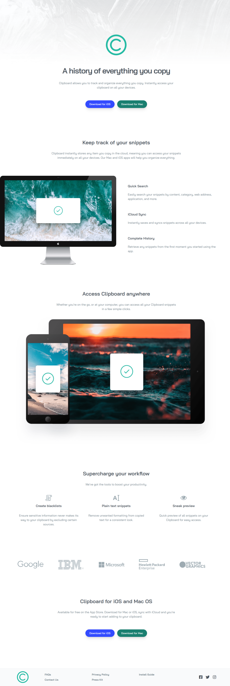

# Frontend Mentor - Clipboard landing page solution

This is a solution to the [Clipboard landing page challenge on Frontend Mentor](https://www.frontendmentor.io/challenges/clipboard-landing-page-5cc9bccd6c4c91111378ecb9). Frontend Mentor challenges help you improve your coding skills by building realistic projects. 

## Table of contents

- [Overview](#overview)
  - [The challenge](#the-challenge)
  - [Screenshot](#screenshot)
  - [Links](#links)
- [My process](#my-process)
  - [Built with](#built-with)
  - [What I learned](#what-i-learned)
  - [Continued development](#continued-development)
  - [Useful resources](#useful-resources)
- [Author](#author)
- [Acknowledgments](#acknowledgments)


## Overview

### The challenge

Users should be able to:

- View the optimal layout for the site depending on their device's screen size
- See hover states for all interactive elements on the page

### Screenshot




### Links

- Solution URL: [Github](https://github.com/rudimediaz/fem-clipboard-landing-page)
- Live Site URL: [Live Site](https://rudhifemclipboard.netlify.app)

## My process

### Built with

- Semantic HTML5 markup
- CSS custom properties
- Flexbox
- CSS Grid
- Mobile-first workflow
- CSS Cascade Layers
- [vite](https://vitejs.dev/) - Bundler
- [sass](https://sass-lang.com) - CSS Preprocessor
- [postcss](https://postcss.org) - Production Ready CSS
- [postcss-preset-env](https://preset-env.cssdb.org/) - Modern Feature CSS


### What I learned


The style guide and design file broke the accessibility constraint. So i decided to adapt the style to match accessibility constraints.


- Style Guide

```md
### Primary

- Strong Cyan: hsl(171, 66%, 44%)
- Light Blue: hsl(233, 100%, 69%)

### Neutral

- Dark Grayish Blue: hsl(210, 10%, 33%)
- Grayish Blue: hsl(201, 11%, 66%)
```

- Changes
```scss
$teal: hsl(171 66% 30%);
$pastel_blue: hsl(233 100% 60%);

:root {
  --clr-n-2: hsl(212 10% 33%);
  --clr-n-1: hsl(201 11% 44%);
}
```


### Useful resources

- [MDN](https://developer.mozilla.org/en-US/docs/Web/Accessibility/Understanding_WCAG/Perceivable/Color_contrast) WCAG color contrast guidelines.


## Author

- Frontend Mentor - [@rudimediaz](https://www.frontendmentor.io/profile/rudimediaz)
- Twitter - [@rudimediaz](https://www.twitter.com/rudimediaz)


